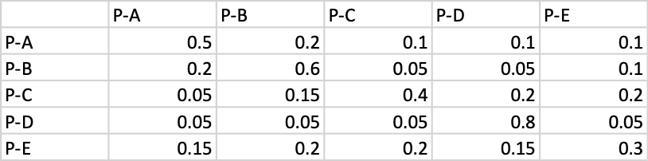

```{r setup, include=FALSE}
knitr::opts_chunk$set(echo = TRUE)
knitr::opts_chunk$set(comment = "")
```

## Definició i notacions

Creem una matriu en R amb la funció `matrix()`. Hem de donar els elements de la matrius en ordre en una sola seqüència, per defecte per columnes. Si ho volem donar per files, hem d'especificar `byrow = TRUE`. Cal especificar el nombre de files o el de columnes, com a mínim un dels dos.


```{r}
A <- matrix(c(2, 0, 3, 4, 7, 5,  5, 4, 9, 10), ncol = 5)
A
B <- matrix(data=c(2, 3, 7, 5, 9, 0, 4, 5, 4, 10), byrow = TRUE, nrow = 2)
B
```

Podem accedir a l'element $a_{i,j}$ de la matriu utilitzant la notació `A[i,j]`

Però recorda que R diferencia entre `A` i `a`! La matriu l'hem definit amb `A` majúscula.

```{r}
A[2,3] # serà l'element de la fila 2 i columna 3
A[,3]  # si no diem quina fila, les torna totes
A[1,]  # si no diem quina columna les torna totes
```

En la notació més habitual el que hem demanat s'escriuria la columna $a_{\cdot 3}$ i la fila $a_{1\cdot}$ (posem un puntet per indicar tota la fila o tota la columna).

Atenció: quan demanem una fila o una columna, R ens torna sempre un vector fila, horitzontal.

### Més exemples

Si volem definir una matriu $A = a_{ij}$ segons una fórmula donada, per exemple, $a_{ij}=i-j$ podem començar per crear una matriu de la dimensió desitjada plena de zeros, i després omplir-la mitjançant dos bucles aniuats:

```{r}
A <- matrix(0, nrow = 5, ncol = 7)
for (i in 1:nrow(A)) 
  for (j in 1:ncol(A)) 
    A[i,j] <- i-j
A
```

Un altre exemple, si volem omplir de 1 el triangle superior d'una matriu quadrada:

```{r}
A2 <- matrix(0, nrow = 7, ncol = 7)
for (i in 1:nrow(A2)) 
  for (j in i:ncol(A2)) # fixa't que la j comença des de i
    A2[i,j] <- 1
A2
```

### Exercici

Construeix amb R la matriu de 5x7 (5 files, 7 columnes) que tingui per element $a_{ij}=i^3-j^2$.


```{r echo=FALSE}
A <- matrix(0, nrow = 5, ncol = 7)
for (i in 1:nrow(A)) 
  for (j in 1:ncol(A)) 
    A[i,j] <- i^3-j^2
```
Hauries d'obtenir la matriu (en columnes) `r A`.

### Igualtat de matrius

Si demanem si dues matrius són iguals, R ens torna la comparació element a element.

```{r }
A <- matrix(c(2, 0, 3, 4, 7, 5,  5, 4, 9, 10), nrow = 2)
B <- matrix(c(2, 0, 3, 4, 7, 5,  5, 4, 9, 10), ncol = 5)
A == B
B[1,3]=13 # canviem l'element (1,3)
A == B
all(A == A) # per veure si tots són TRUE
all(A == B)
```

### Suma, diferència, producte per escalars de matrius

Aquí treballem amb matrius igual que amb nombres.

```{r}
A <- matrix(c(1, 2, 3, 1, 1, 0), byrow = TRUE, nrow = 2)
B <- matrix(c(1, 0, 5, 1, 1, 6), byrow = TRUE, nrow = 2)
A + B
A - 2 * B
3 * A
-B
```

### El producte de matrius. No és commutatiu!

Si fem servir el producte de nombres `*`, R fa el producte element a element. El producte matricial es fa amb `%*%`.

```{r}
A <- matrix(c(1, 2, 3, 1, 1, 0, -2, 1), byrow = TRUE, nrow = 2) # matriu 2 x 4
B <- matrix(c(1, 0, 5, 1, 1, 6, -1, 0), byrow = TRUE, nrow = 4) # matriu 4 x 2
A %*% B  # serà matriu 2 x 2
B %*% A  # serà matriu 4 x 4
```

En el cas de matrius quadrades sempre podem canviar l'ordre del producte, de vegades el resultat serà el mateix, de vegades no.

```{r}
A <- matrix(c(1, 2, 3, 1, 1, 0, -2, 1, 0), byrow = TRUE, nrow = 3) # matriu 3 x 3
B <- matrix(c(-2, 1, 0, 5, 1, 1, 6, -1, 0), byrow = TRUE, nrow = 3) # matriu 3 x 3
A %*% B
B %*% A
C <- diag(c(1,2,3)) # matriu diagonal amb 1, 2, 3 a la diagonal
D <- diag(c(2,-1, 0))
D %*% C == C %*% D
```

### La matriu identitat

Amb la funció *diag* que hem fet  servir suara, podem construir la matriu identitat de la dimensió que ens interessi

```{r}
I5 <- diag(1, nrow = 5)
I5
```

Com has vist, no cal que donem `1` cinc vegades, R recicla el que donem si li cal.

### Potència de matrius quadrades

```{r}
A <- matrix(c(1, 0, 3, 0.5), nrow=2)
A %*% A
A %*% A %*% A %*% A
```


### La transposada

Fem servir la funció `t()` per transposar matrius.

```{r}
A <- matrix(c(1, 2, 3, 1, 1, 0, -2, 1, 0), byrow = TRUE, nrow = 3) # matriu 3 x 3
B <- matrix(c(-2, 1, 0, 5, 1, 1, 6, -1, 0), byrow = TRUE, nrow = 3) # matriu 3 x 3
C <- matrix(1:12, nrow = 3)  # matriu 3 x 4 omplerta amb els nombres del 1 al 12 per columnes
C
t(C) # transposada de C
# La transposada del producte es el producte de transposades en ordre transposat!
t(A %*% B) == t(B) %*% t(A) 
```

### Matrius simètriques

```{r}
A <- matrix(c(1, 2, 3, 1, 1, 0, -2, 1, 0), byrow = TRUE, nrow = 3) # matriu 3 x 3
TA <- A %*% t(A)
TA == t(TA)  # és una matriu simètrica?
```

### Traça d'una matriu quadrada

No hi ha una funció específica en R per calcular la traça, no cal. La funció `diag()` que abans hem fet servir per construir una matriu diagonal a partir dels nombres de la diagonal, també serveix per extreure la diagonal d'una matriu.

Aqui construirem una matriu amb nombres aleatoris de $[0,1]$ i en farem la traça:

```{r}
A <- matrix(runif(9), byrow = TRUE, nrow = 3)
diag(A)
sum(diag(A)) # serà la traça
```

## Exercicis

Ara et toca a tu. 

1.- Comprova la propietat associativa del producte de matrius amb tres matrius de dimensions 2 per 3, 3 per 4 i 4 per 2.

2.- Producte de matriu i vector. Si entrem un vector en R fent servir la funció `c()`, R d'entrada l'interpreta con un vector fila (de fet com un vector sense dimensions). Però quan el fem servir en un producte matricial, R el "promou" a les dimensions adequades. Comprova-ho amb alguns exemples: fes una matriu de 3 per 4, pre-multiplica-la per `v <- c(1,0,-1)` i comprova si ha interpretat `v` com a un vector fila de 1 per 3. Post-multiplica-la per `w <- c(1,0,-1,-2)` i comprova si ha interpretat correctament `w` com a vector columna de 4 per 1.


Podeu trobar un resum de com treballar amb matrius en R al web (https://www.statmethods.net/advstats/matrix.html), amb més funcions de les que hem vist aquí.

## Cadenes de Markov, matrius de transició

### Matrius de transferència de vots

Posem que en una enquesta s'ha demanat a l'entrevistat què va votar a les darreres eleccions i què vol votar ara. Disposarem les dades en una matriu $T=(t_{ij})$ on l'element $i, j$, fila $i$ i columna $j$ és el percentatge de votants del partit $i$ que ara han decidit votar al partit $j$. Posem que tenim aquestes dades:



Això vol dir que dels votants anteriors al partit A, el 20% es passen al B, el 10% al C, però el 50% resten fidels al partit A.

Quin és el partit amb major fidelitat de vot? Caldrà mirar la diagonal.

Si tenim les dades en un full Excel Transf-Vots.xlxs, podem llegir-les en R:

```{r}
library(readxl)
t.data <- read_excel("Transf-Vots.xlsx", col_names = TRUE)
# suprimim la primera columna que son els noms
# i ho posem en format de matriu
T <- as.matrix(t.data[,-1]) 
T
```
Per suposat, també podem entrar les dades "a mà", en columnes:

```{r}
T <- matrix(c(0.5, 0.2, 0.05, 0.05, 0.15, 0.2, 0.6, 0.15, 0.05, 0.2, 0.1, 0.05, 0.4, 0.05, 0.2, 0.1, 0.05, 0.2, 0.8, 0.15, 0.1, 0.1, 0.2, 0.05, 0.3), nrow = 5)
T
```

En qualsevol cas tenim la mateixa matriu que en direm la "matriu de transferència de vots".

Aquesta matriu ens permet passar de la distribució de vots de les anteriors eleccions als resultats previstos per a la següent. Com ho hem de fer?

Posem que a les anteriors la distribució dels vots va ser A: 0.35, B: 0.25, C:0.20, D: 0.15, E: 0.05. Això ho podem representar en un vector:

```{r}
V <- c(0.35, 0.25, 0.20, 0.15, 0.05)
V
```

Llavors, per calcular quina seria la distribució de vots per les properes elecions, quin càlcul matricial hem de fer? Creus que hauria de ser $T\cdot V$? O bé $V\cdot T$? Raona la teva resposta.

Resposta: raona-ho, però el resultat ha de ser `r V%*%T`.

### Cadena de Markov pels usos de transport públic

Aquest tipus de model reben el nom de Cadenes de Markov. Ara veiem un altre exemple: els viatges a la ciutat de Barcelona es poden realitzar en cotxe privat (P), transport públic (M), bicicleta (B) o a peu (P). Posem que actualment les proporcions siguin, respectivament, 0.18, 0.38, 0.12, 0.32.

Podeu consultar dades reals del 2018 a ![https://www.idescat.cat/serveis/biblioteca/docs/bib/pec/paae2018/a07322018.pdf]

Segons els estudis de l'autoritat metropolitana del transport, la gent que va ara en cotxe seguirà usant-lo en un 60% dels casos però canviarà a M, B, P en proporcions 25%, 5%, 10% respectivament. Els que van en transport públic passaran a C, B, P en proporcions 10%, 12%, 5%. Els de la bicicleta canviaran a C, M, P amb proporcions 2%, 5%, 5%. I els que van a peu canviaran a C, M, B en proporcions 2%, 10%, 5%.

Calcula la matriu de transició T i les proporcions previstes segons aquestes dades per l'any següent.

```{r echo=FALSE}
V <- c(0.18, 0.38, 0.12, 0.32)
T <- matrix(c(0.6, 0.25, 0.05, 0.10,
              0.1, 1-0.10-0.12-0.05, 0.12, 0.05,
              0.1, 0.12, 1-0.10-0.12-0.05, 0.05,
              0.02, 0.05, 0.05, 1-0.02-0.05-0.05), byrow = TRUE, ncol = 4)

V %*% T
```
Resposta: el vector de les proporcions actuals és `r V`, i el resultant d'aplicar la matriu de transició serà `r c(V%*%T)`.

### Exercici

Suposa que cada any, el 60% dels que viuen a la ciutat gran decideixen restar a la ciutat mentre que el 10% se'n van a viure a un poble i el 30% marxen al camp. El 40% que viuen a un poble se'n van a la ciutat, el 20% es queden al poble i el 40% se'n van al camp i el 70% dels que viuen al camp se'n van a la ciutat, el 20% se'n van al poble i el 10% es queden al camp.

Construeix la matriu de transició `U` i calcula quina serà la distribució de la gent entre ciutat, poble i camp l'any que ve si enguany és de `0.7, 0.25, 0.05`.

```{r echo=FALSE}
U <- matrix(c(0.6,0.1,0.3, 0.4,0.2, 0.4, 0.7, 0.2, 0.1), byrow=TRUE, ncol=3)
v <- c(0.7, 0.25, 0.05)
```

Resposta: `r v%*%U`.

Què passaria si aquesta transferència entre habitants es produís any rere any durant molt temps? Comprova que després, posem per cas, de 7 anys s'hauria arribat a una situació (aproximadament) estacionaria, és a dir que ja no canviaria encara que tornéssim a aplicar la matriu de transició. Digues quina seria la situació llavors.

```{r echo= FALSE}
U7 <- U%*%U%*%U%*%U%*%U%*%U%*%U
v %*% U7
```

Resposta: L'estat estacionari és `r v%*%U7`. Si li apliquem la matriu de transició es queda igual.

No entrem aquí en l'estudi de les Cadenes de Markov. Hi ha tècniques molt interessants per analitzar les seves propietats i tenen moltes aplicacions pràctiques.

## Només per friquis del R
(o gent interesada en aprendre a programar)

Si volguéssim fer potències d'exponent més alt, podem definir la potència de manera recursiva $A^n=A\cdot A^{n-1}$ amb $A^1=A$:

```{r}
potencia.matriu <- function(matriu, exponent) {
  if(exponent==1) 
    return(matriu)
  else {
    pot <- potencia.matriu(matriu, exponent-1)
    return(matriu %*% pot)
  }
}

A <- matrix(c(1, 0, 3, 0.5), nrow=2)
potencia.matriu(A, 100)
# o si arrodonim
round(potencia.matriu(A, 100), 2)
```


