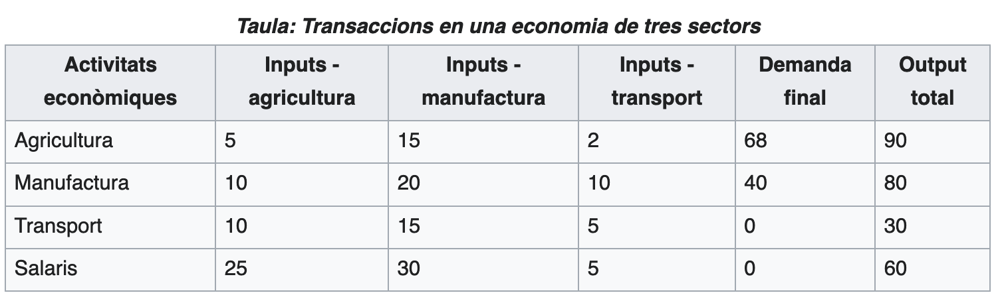
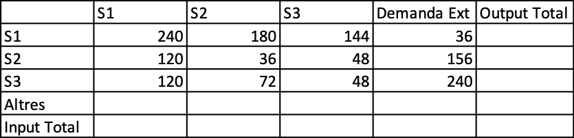
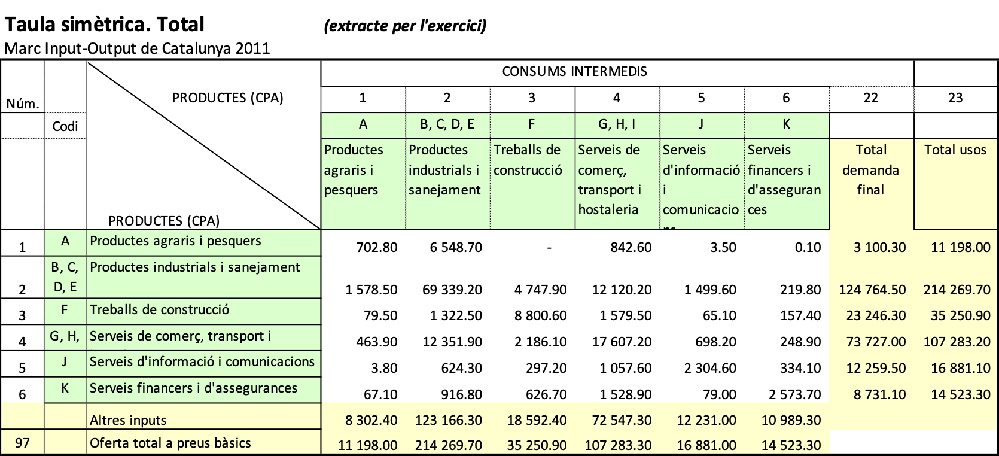

```{r setup, include=FALSE}
knitr::opts_chunk$set(echo = TRUE)
knitr::opts_chunk$set(comment = "")
```

## Definició i notacions

Calcular la inversa d'una matriu quadrada en R és ben fàcil, fem servir la funció **solve()**. Més endavant entendreu perquè calcular la inversa és el mateix que "resoldre".

```{r}
A <- matrix(c(2, 0, 3, 4, 7, 5,  5, 4, 9), ncol = 3)
A
solve(A)
```

R fa sempre els càlculs amb la versió decimal (se'n diu de coma flotant, vegeu el final de l'anterior guia) dels nombres implicats. Entre altres coses, això té l'aventatge de ser molt més eficient, fins i tot amb matrius més o molt grans.

```{r}
A <- matrix(sample(-24:24), nrow = 7) # són els nombres des de -24 fins a 24 reordenats aleatoriament
A
iA <- solve(A) # la inversa
round(iA,4) # arrodonim a quatre decimals
A %*% iA # el producte ha de ser la matriu identitat:
```

Com veieu, aixó té l'inconvenient que de vegades no s'entén a la primera el què hem obtingut, aquesta matriu identitat no ho sembla gaire degut als petitíssims errors que s'acumulen en els càlculs amb decimals.

Podem demanar el resultat arrodonit i ho veiem clar:

```{r}
round(A %*% iA,4)
```

### Resoldre un sistema d'equacions lineals és multiplicar per la inversa.

Com que un sistema d'equacions lineals es pot escriure matricialment com a ${\mathbf A}{\mathbf X}={\mathbf b}$, la solució serà ${\mathbf X}={\mathbf A}^{-1}{\mathbf b}$. Per tant, per resoldre el sistema 
$$\begin{array}{lcc} x+2y-z&=&-5\\2x-y+z&=&6\\x-y-3z&=&-3 \end{array}$$ farem:

```{r}
A <- matrix(c(1,2,1,2,-1,-1,-1,1,-3), nrow = 3)
A
b <- c(-5, 6, -3)
solve(A,b)
```

Observa que la funció **solve()** que hem fet servir per calcular la inversa, si li donem un segon argument, ens torna el producte de la inversa per aquest segon argument.

```{r}
solve(A) %*% b - solve(A,b)  # pràcticament zero
```

### Matrius ortogonals

La matriu de l'exemple de la guia:

```{r}
P <- matrix(c(1,-1,1,1),nrow = 2) / sqrt(2)
P
solve(P) # la inversa és la transposada
P %*% t(P)
t(P) %*% P
```

Per ortogonalitzar una matriu, R fa servir un mètode anomenat de Gram-Schmidt, disponible al paquet **pracma**. No hi entrem en aquest curs, però el podeu trobar força ben explicat a (https://ca.wikipedia.org/wiki/Proc%C3%A9s_d%27ortogonalitzaci%C3%B3_de_Gram-Schmidt).

L'apliquem a un exemple.

```{r}
library(pracma) # potser us cal fer install.packages("pracma") si no el teniu instal·lat

A <- matrix(sample(-12:12), nrow = 5) # són els nombres des de -12 fins a 12 reordenats aleatoriament
A
nA <- gramSchmidt(A)$Q # la matriu ortogonal
nA
round(nA %*% t(nA), 4) # comprovem que la transposada es la inversa
```

## Els models input-output de Leontieff


Aquí ens referirem a la pàgina ![https://en.wikipedia.org/wiki/Input%E2%80%93output_model] Model input-output de la Viquipedia, o en català: ![https://ca.wikipedia.org/wiki/Model_input-output]

Si dividim la economia d'un país en $N$ sectors, 
la matriu input-output té elements $a_{ij}$ que s'interpreten com que el sector $j$ per produir una unitat necessita consumir $a_{ij}$ unitats de cada sector $i$.

Per tant, si $\mathbf{x} = (x_1, x_2, \dots, x_N)'$ és el vector de output dels sectors, i $\mathbf{d}=(d_1, d_2, \dots, d_N)'$ és el vector de les demandes finals de cada sector, es tindrà 
\[x_i = a_{i1} x_1 + a_{i2} x_2, \dots, a_{iN} x_N + d_i\]
o en forma matricial
\[\mathbf{x} = \mathbf{A} \mathbf{x} + \mathbf{d}\]
o bé, posant $\mathbf{x}=\mathbf{I}\mathbf{x}$ amb $\mathbf{I}$ la matriu identitat,
\[(\mathbf{I}-\mathbf{A})\mathbf{x} =  \mathbf{d}, \qquad \mathbf{x}=(\mathbf{I}-\mathbf{A})^{-1} \mathbf{d}\]
suposant que la matriu és invertible.

Podeu consultar un exemple senzill al llibre Matemáticas aplicadas a la Administración y a la Economía de J.C. Arya i L.W. Lardner, Pearson, México 2009. Algunes pàgines al fitxer ![http://pascal.upf.edu/math21/mates1-21/matrius/Arya-Lardner-p.pdf] Arya-Lardner-p.pdf.


Considerem l'exemple de la Viquipèdia, ![https://ca.wikipedia.org/wiki/Model_input-output]



(observa que, per exemple, el terme $(1,2)$ de la matriu serà $15=a_{12}x_2=a_{12}80$ i per tant $a_{12}015/80$, i així la resta.)

Tindrem \(\mathbf{A}=\left(\begin{array}{ccc} 5/90&15/80&2/30\\10/90&20/80&10/30\\10/90&15/80&5/30\end{array}\right)\), i \(\mathbf{d}=(68,40,0)'\).

```{r}
A = matrix(c(5/90, 15/80, 2/30, 10/90, 20/80, 10/30, 10/90, 15/80, 5/30), ncol=3, byrow=TRUE)
A
```

Amb la qual cosa la matriu inversa de Leontieff és $(\mathbf{I}-\mathbf{A})^{-1}$

```{r}
L = solve(diag(1, nrow=3) - A)
L
```

que permet calcular la producció necessària per cobrir una demanda determinada, per exemple si prenem la demanda que hem introduït al model:

```{r}
L%*% c(68,40,0)
```

Però si preveiem que la demanda serà $(120,70,10)'$, per satisfer-la la producció haurà de ser:

```{r}
L%*% c(120,70,10)
```

### Exercici

Donades les dades de consum i producció d'una economia amb tres sectors S1, S2, S3, calcula la matriu input-output de manera semblant a com ho hem fet suara, calcula la matriu inversa de Leontieff i fes-la servir per obtenir els nivells de producció necessaris per satisfer una demanda de $(80, 200, 500)'$

Tingues en compte que no s'han donat els nivells totals de producció (que han de coincidir amb els inputs totals) i també hauràs de calcular els nivells de inputs auxiliars.


```{r echo=FALSE}
A = matrix(c(240/600, 180/360, 144/484, 
             120/600, 36/360, 48/484, 
             120/600, 72/360, 48/480), ncol=3, byrow=TRUE)
Otot <- c(600, 360, 480)
dext <- c(36, 156, 240)
L <- solve(diag(1, nrow=3)-A)
d2 <- L %*% c(80, 200, 500)
```

Respostes: la matriu input-output és (en columnes) `r round(A,2)`. La inversa de Leontieff, també en columnes `r round(L,2)` i la producció demanada és `r round(d2, 2)`.


### Exercici més real

Les dades de matrius input-output per a l'economia mundial les podeu trobar a ![http://www.wiod.org/home].

Les dades reals referents a Catalunya les podeu trobar a ![https://www.idescat.cat/estad/mioc] però com a exercici del curs són massa complexes d'explicar i analitzar ja que considera desenes de sectors per analitzar l'economia del país. 

Aquí n'hem extret alguns sectors per tenir un exemple més senzill.



Donades les dades de la figura, que també pots trobar a ![http://pascal.upf.edu/math21/mates1-21/matrius/Exemple-IO-cat.xlsx], se't demana construir la matriu input-output corresponent i els vectors de producció total i de demanda total.

```{r echo=FALSE}
taula <- matrix( c(702.80, 6548.70, 0, 842.60, 3.50, 0.10,
               1578.50, 69339.20, 4747.90, 12120.20, 1499.60, 219.80,
               79.50, 1322.50, 8800.60, 1579.50, 65.10, 157.40,
               463.90, 12351.90, 2186.10, 17607.20, 698.20, 248.90,
               3.80, 624.30, 297.20, 1057.60, 2304.60, 334.10,
               67.10, 916.80, 626.70, 1528.90, 79.00, 2573.70 ), byrow=TRUE, ncol=6)
d <- c(3100.30, 124764.50, 23246.30, 73727.00, 12259.50, 8731.10)
tot <- c(11198.00, 214269.70, 35250.90, 107283.20, 16881.10, 14523.30)
A <- t(t(taula)/tot)
#print(round(A,4))
L <- solve(diag(nrow=6)-A)
d2 <- L%*%c(5000, 150000, 30000, 80000,18000, 10000)
#print(round(L,4))
```
Ajuda: La tercera fila de la matriu ha de ser `r round(A[3,],4)`

Calcula també la matriu inversa de Leontieff. (Ajuda, la tercera columna ha de ser `r round(L[,3],2)`).

Finalment, calcula els nivells de producció necessaris per satisfer una demanda de `(5000, 150000, 30000, 80000,18000, 10000)'`. (Ajuda: el resultat ha de ser `r paste(round(d2,2))`).
